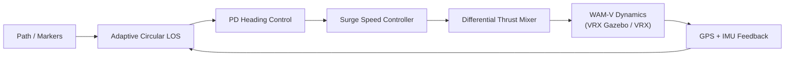

# 🚤 Autonomous ASV Docking and Path Tracking  
### MATLAB / Simulink + ROS 2 + Gazebo (VRX)

[](https://docs.ros.org/en/jazzy/)
[](https://www.mathworks.com/products/matlab.html)
[](https://www.mathworks.com/products/simulink.html)
[](https://gazebosim.org/)
[](https://ubuntu.com/)
[](https://github.com/osrf/vrx)

A complete **Guidance, Navigation, and Control (GNC)** framework for a **WAM‑V Catamaran Autonomous Surface Vessel (ASV)** validated in the **VRX (Virtual RobotX)** high‑fidelity simulation environment.

This project integrates:

- 3‑DOF vessel dynamics modeling  
- Adaptive Circular Line‑of‑Sight (LOS) guidance  
- PD‑based heading control  
- Surge velocity regulation  
- Differential thrust mixing (twin thrusters)  
- Real‑time ROS 2 communication  
- Precision autonomous docking strategy  

✅ Smooth path tracking and **zero‑overshoot docking** without RPM discontinuities.

---

## 📌 Table of Contents

- [Key Features](#-key-features)
- [System Architecture](#-system-architecture)
- [Performance Improvements](#-performance-improvements)
- [System Requirements](#-system-requirements)
- [Repository Layout](#-repository-layout)
- [Installation & Setup](#-installation--setup)
- [Execution Order](#-execution-order)
- [ROS Interface](#-ros-interface)
- [Notes](#-notes)
- [Author](#-author)
- [License](#-license)

---

## ✨ Key Features

- **Adaptive Circular LOS Guidance**  
  Continuous path progression without waypoint switching spikes.

- **Smooth Differential Thrust Profile**  
  Eliminates saw‑tooth RPM oscillations caused by discrete waypoint jumps.

- **Distance‑Based Docking Deceleration**  
  Square‑root velocity shaping for precise, zero‑overshoot stopping.

- **Turn‑Then‑Go Strategy**  
  Reduces surge speed during large heading errors for safe maneuvering.

- **Real‑Time Simulink ↔ ROS 2 Integration**  
  Live GPS and IMU feedback from Gazebo with real‑time thrust publishing.

---

## 🧠 System Architecture



### Control Design Highlights

- Continuous spline‑based path tracking  
- Adaptive lookahead radius near docking zone  
- Heading latch for final approach stability  
- Differential thrust control for twin‑hull propulsion  

---

## 🛠 System Requirements

### 🖥 Operating System

- Ubuntu 24.04 LTS  
- ROS 2 Jazzy  
- Gazebo Harmonic  
- VRX Simulator (`vrx_gz`)  
  https://github.com/osrf/vrx  

---

## 📦 MATLAB / Simulink Requirements

This project was developed and validated using:

- **MATLAB R2025b Update 3**
- **Simulink (R2025b)**

#### 🔧 Required Toolboxes

All toolboxes below are **actively used within the Simulink model** and required for full functionality:

- Aerospace Blockset  
- Aerospace Toolbox  
- Automated Driving Toolbox  
- Computer Vision Toolbox  
- Control System Toolbox  
- Image Processing Toolbox  
- ROS Toolbox (ROS 2 interface)  
- Simulink Control Design  

> ⚠️ Missing toolboxes may cause unresolved block errors or simulation failures.

#### 🔍 Verify Installed Toolboxes

Run inside MATLAB:

```matlab
ver
```

Ensure all required toolboxes appear before running the model.

---

## 📂 Repository Layout

Your modified VRX world file is version‑controlled inside this repository at:

```text
vrx_world/sydney_regatta.sdf
```

Recommended structure:

```text
asv-autonomous-docking-and-path-tracking/
├── src/
│   ├── functions/
│   └── main/
├── scripts/
│   └── update_path_sydney_regatta.py
├── vrx_world/
│   └── sydney_regatta.sdf          ✅ (Modified VRX world file)
├── docs/
└── results/
```

---

## 🚀 Installation & Setup

### 1️⃣ Install VRX (Mandatory)

Follow official instructions:

https://github.com/osrf/vrx

---

### 2️⃣ Clone This Repository

```bash
git clone https://github.com/kavindagehan/asv-autonomous-docking-and-path-tracking.git
cd asv-autonomous-docking-and-path-tracking
```

---

### 3️⃣ Source ROS 2 (and VRX workspace if applicable)

```bash
source /opt/ros/jazzy/setup.bash
```

If VRX was built in a workspace:

```bash
source ~/vrx_ws/install/setup.bash
```

---

### 4️⃣ Replace VRX `sydney_regatta.sdf` (REQUIRED — do this BEFORE MATLAB)

This project depends on a modified `sydney_regatta.sdf` that contains the marker tags:

```xml
<!-- START-MARKERS -->
<!-- END-MARKERS -->
```

These tags are required for **automatic path injection** (triggered by the MATLAB live script).

#### 4.1 Locate your VRX worlds directory

**Case A — VRX built from source (common):**

```bash
VRX_WORLDS_DIR=~/vrx_ws/src/vrx/vrx_gz/worlds
```

**Case B — VRX available via package share directory:**

```bash
VRX_WORLDS_DIR="$(ros2 pkg prefix vrx_gz)/share/vrx_gz/worlds"
```

Verify the directory exists:

```bash
ls "$VRX_WORLDS_DIR"
```

#### 4.2 Backup the original world file

```bash
cd "$VRX_WORLDS_DIR"
mv sydney_regatta.sdf sydney_regatta_original.sdf
```

#### 4.3 Copy the modified world file from this repository

Run this from the **repo root**:

```bash
cp vrx_world/sydney_regatta.sdf "$VRX_WORLDS_DIR/"
```

#### 4.4 Quick validation (confirm marker tags exist)

```bash
grep -n "START-MARKERS\|END-MARKERS" "$VRX_WORLDS_DIR/sydney_regatta.sdf"
```

✅ If both markers are printed, the world file is correctly installed.

---

## ▶️ Execution Order

> ✅ **Manual “Dynamic Path Injection” is NOT required.**  
> Path injection is performed automatically when running: `ASV_SIM_ROS_MAIN_V2_1.mlx`.

### 1) Open MATLAB / Simulink

Start MATLAB first (recommended), then run the main live script:

- **Run:** `ASV_SIM_ROS_MAIN_V2_1.mlx`  
  - This automatically performs the required path injection into the VRX world file
  - It also configures ROS 2 communication required by the Simulink model

---

### 2) Build VRX workspace (if VRX is built from source)

```bash
cd ~/vrx_ws
colcon build --merge-install
```

> If VRX is already built and unchanged, you can skip this build step.

---

### 3) Launch the VRX simulation

```bash
ros2 launch vrx_gz competition.launch.py world:=sydney_regatta
```

---

### 4) Run the Simulink model

Open and run:

- **Simulink model:** `Simulink_ROS_Boat_Path_Follow_V2_5.slx`

(Ensure the model is in **Run** mode and publishing thrust commands.)

---

### 5) Verify ROS topics (optional check)

List topics:

```bash
ros2 topic list
```

Check thrust output:

```bash
ros2 topic echo /wamv/thrusters/left/thrust
```

---

## 🔁 ROS Interface

### Subscribed Topics

- `/wamv/sensors/gps/gps/fix`
- `/wamv/sensors/imu/imu/data`

### Published Topics

- `/wamv/thrusters/left/thrust`
- `/wamv/thrusters/right/thrust`

---

## 📌 Notes

- Environmental disturbances (wind, waves, current) can be enabled in VRX for robustness testing.
- Validation was performed under still‑water conditions for baseline benchmarking.
- The original world file is preserved as a backup (`sydney_regatta_original.sdf`).
- If the VRX world file does **not** contain the marker tags, the MATLAB live script’s automatic path injection will fail.

---

## 👨‍🎓 Author

**Gehan Kavinda Dasanayake**  
GitHub: https://github.com/kavindagehan  
Research Project – Carinthia University of Applied Sciences

---

## 📜 License

This project is licensed under the MIT License.

See the LICENSE file for details.